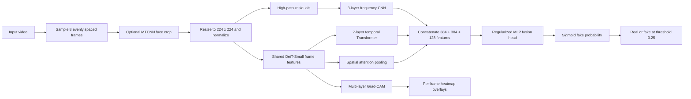

# Triple-Stream Deepfake Video Detection

[](https://www.python.org/)
[](https://pytorch.org/)
[](https://flask.palletsprojects.com/)
[](https://www.docker.com/)

An explainable video deepfake-detection research prototype that combines spatial, temporal, and frequency-domain evidence. The repository includes the trained Attempt 10 checkpoint, a Flask web application, single and batch inference APIs, Grad-CAM visualizations, and the notebooks used for model development.

The associated paper, **"Triple-Stream Vision Transformer Framework for Deepfake Video Detection with Stochastic Depth Regularization,"** has been accepted for presentation at **IEEE ICONAT 2026**. A publication link will be added after the paper appears in the conference proceedings.

> [!IMPORTANT]
> This is a research prototype, not a forensic certification system. A prediction is a model score, not proof that a video is authentic or manipulated. Validate results with additional tools and human review before making consequential decisions.

## Highlights

- Three complementary streams: spatial, temporal, and frequency analysis.
- Shared DeiT-Small backbone with stochastic depth for frame-level representations.
- Temporal Transformer encoder for inter-frame consistency.
- High-pass CNN for manipulation artifacts that may be subtle in RGB space.
- Grad-CAM overlays from the last four DeiT blocks for frame-level inspection.
- Flask interface with single-video and batch analysis endpoints.
- Automatic CPU/CUDA selection and a GPU-ready Docker configuration.
- Identity-grouped train, validation, and test splits to reduce subject leakage.

## Deployed model results

The web application loads `best_triple_stream_v10.pth`, which corresponds to **Attempt 10** in `attempt-10.ipynb`. The values below are taken from the stored notebook output for the best checkpoint, selected by validation ROC-AUC.

### Overall held-out test set

| Metric | Result |
| --- | ---: |
| Test samples | 1,231 |
| Accuracy | **90.09%** |
| F1 score | **0.9383** |
| ROC-AUC | **0.9362** |
| Best validation ROC-AUC | **0.9458** |
| Classification threshold | **0.25** |

### Per-dataset test results

| Dataset label | Samples | Accuracy | F1 | ROC-AUC |
| --- | ---: | ---: | ---: | ---: |
| Celeb-DF v2 | 619 | 88.53% | 0.9285 | 0.9460 |
| DFD | 327 | 92.05% | 0.9583 | 0.6529 |
| FaceForensics++ | 285 | 91.23% | 0.9307 | **0.9669** |
| **Overall** | **1,231** | **90.09%** | **0.9383** | **0.9362** |

The full tensor dataset contained 12,862 samples: 10,354 for training, 1,277 for validation, and 1,231 for testing. The test set was imbalanced (226 real and 1,005 fake samples), so ROC-AUC and F1 should be considered alongside accuracy.

Attempt 11 explored 16-frame input, cross-attention, multi-scale frequency filters, mixup, and exponential moving averages. It reached 0.9430 test ROC-AUC but lower accuracy and F1 than Attempt 10. Its checkpoint is not used by the current application.

## How the model works



1. **Frame sampling** - OpenCV reads the video and selects eight evenly spaced frames.
2. **Face extraction** - When `facenet-pytorch` is installed, MTCNN detects the primary face and includes a 30% margin. Without it, the complete frame is used.
3. **Preprocessing** - Frames are resized to 224 x 224, converted to tensors, and normalized with ImageNet statistics.
4. **Spatial stream** - DeiT-Small generates a 384-dimensional representation for each frame. Learned attention weights pool the most useful frame evidence.
5. **Temporal stream** - A two-layer, six-head Transformer encoder processes the ordered frame sequence and returns a 384-dimensional temporal representation.
6. **Frequency stream** - A 7 x 7 high-pass residual removes low-frequency content. A compact CNN extracts a 128-dimensional artifact representation.
7. **Fusion** - The three representations form an 896-dimensional vector. A regularized MLP produces one logit, which is converted to a fake probability.
8. **Explainability** - Grad-CAM aggregates signals from the final four DeiT blocks to highlight influential regions in each sampled frame.

The model has approximately **24.59 million trainable parameters**.

## Quick start - local installation

### Prerequisites

- Git
- Python 3.10 or newer
- Approximately 100 MB for the included model checkpoint, plus space for Python packages
- Optional: an NVIDIA GPU with a compatible CUDA-enabled PyTorch build

### 1. Clone the repository

```bash
git clone https://github.com/Harshvoidmain/Triple_Stream_Deepfake_Detection.git
cd Triple_Stream_Deepfake_Detection
```

### 2. Create and activate a virtual environment

Windows PowerShell:

```powershell
py -3.11 -m venv .venv
.\.venv\Scripts\Activate.ps1
```

macOS or Linux:

```bash
python3 -m venv .venv
source .venv/bin/activate
```

### 3. Install the dependencies

```bash
python -m pip install --upgrade pip
python -m pip install -r requirements.txt
```

Optional but recommended for face cropping:

```bash
python -m pip install facenet-pytorch
```

For NVIDIA acceleration, select the PyTorch command that matches your operating system and CUDA version from the [official PyTorch installation selector](https://pytorch.org/get-started/locally/). Install that PyTorch build before installing the remaining requirements.

### 4. Confirm the checkpoint is present

The following file must exist in the repository root:

```text
best_triple_stream_v10.pth
```

> [!WARNING]
> `model.py` currently falls back to randomly initialized weights when the checkpoint is missing. Those predictions are invalid. Do not use the application unless the checkpoint-loaded message appears in the terminal.

### 5. Start the application

```bash
python app.py
```

Open [http://127.0.0.1:5050](http://127.0.0.1:5050) in a browser. The first analysis may take longer because the checkpoint and face detector are loaded lazily.

The code automatically uses CUDA when `torch.cuda.is_available()` is true; otherwise, it runs on the CPU. CPU inference works but can be substantially slower, especially because Grad-CAM performs additional backward passes for every sampled frame.

## Quick start - Docker with an NVIDIA GPU

The included image is based on PyTorch with CUDA 12.1. Install Docker and the [NVIDIA Container Toolkit](https://docs.nvidia.com/datacenter/cloud-native/container-toolkit/latest/install-guide.html), then run:

```bash
docker compose up --build
```

Open [http://localhost:5000](http://localhost:5000). Check service health with:

```bash
curl http://localhost:5000/api/health
```

The Compose file requests an NVIDIA GPU. For a machine without one, use the local CPU setup above or remove the GPU reservation from `docker-compose.yml`. The first Docker build is large because it downloads a CUDA-enabled PyTorch base image.

See [README-DOCKER.md](README-DOCKER.md) for additional container-management notes.

## Using the application

### Web interface

1. Open the local URL.
2. Upload an MP4, MKV, AVI, MOV, or WebM video.
3. Select **Analyze** and wait for inference and Grad-CAM processing.
4. Review the overall verdict, fake probability, risk level, per-stream scores, per-frame probabilities, and heatmap overlays.
5. Use batch mode to process multiple videos sequentially.

The built-in sample cards are demonstrations and generate synthetic example values. Uploaded videos are sent to the real backend. If the backend request fails, the current interface can fall back to a simulated result; always check the server terminal and confirm that the request completed successfully before interpreting a result.

### REST API

| Method | Endpoint | Purpose |
| --- | --- | --- |
| `GET` | `/api/health` | Service status and version |
| `POST` | `/api/analyze` | Analyze one video from the `video` form field |
| `POST` | `/api/batch` | Analyze videos from repeated `videos` form fields |

Single video, using the local development server:

```bash
curl -F "video=@path/to/video.mp4" http://127.0.0.1:5050/api/analyze
```

Batch analysis:

```bash
curl -F "videos=@video_1.mp4" -F "videos=@video_2.mp4" http://127.0.0.1:5050/api/batch
```

A successful response includes fields such as:

```json
{
  "prediction": "fake",
  "prob_fake": 0.82,
  "confidence": 82.0,
  "threshold": 0.25,
  "risk_level": "CRITICAL",
  "num_frames": 8,
  "device": "cuda:0",
  "stream_scores": {
    "spatial": 78.4,
    "temporal": 81.7,
    "frequency": 69.2
  }
}
```

Values in this example are illustrative; actual output depends on the uploaded video.

## Configuration

Inference settings are defined near the top of `model.py`:

| Setting | Default | Meaning |
| --- | ---: | --- |
| `NUM_FRAMES` | 8 | Evenly spaced frames analyzed per video |
| `IMG_SIZE` | 224 | Input width and height |
| `THRESHOLD` | 0.25 | Fake-class decision threshold selected on validation data |
| `MODEL_PATH` | `best_triple_stream_v10.pth` | Deployed Attempt 10 checkpoint |

Changing the architecture or frame count requires a compatible checkpoint. Changing the decision threshold changes the accuracy/precision/recall trade-off and should be validated on data representative of the intended use case.

## Reproducing the experiments

The research notebooks were developed for a Kaggle GPU environment and use pre-extracted PyTorch tensors.

Install the additional notebook dependencies:

```bash
python -m pip install jupyter kagglehub albumentations scikit-learn pandas matplotlib seaborn tqdm
```

Then start Jupyter:

```bash
jupyter lab
```

### Notebook guide

- `attempt-10.ipynb` - deployed 8-frame model; concatenation fusion; focal loss with label smoothing; DropPath 0.2; checkpoint selected by validation ROC-AUC.
- `attempt-11.ipynb` - experimental 16-frame model; cross-attention; multi-scale high-pass filters; mixup; EMA; not deployed by the current application.

The notebooks download these Kaggle tensor datasets through KaggleHub:

- Attempt 10: `nightfury22344/brand-new-dataset`
- Attempt 11: `nightfury22344/new-dataset-11`

Configure Kaggle credentials before running the download cells. Attempt 10 caches the tensor dataset in RAM and estimates roughly 15.5 GB of memory for the complete cache. Re-running training therefore requires significantly more resources than running inference.

### Attempt 10 training configuration

| Parameter | Value |
| --- | ---: |
| Seed | 42 |
| Input | 8 x 3 x 224 x 224 |
| Effective batch size | 16 |
| Optimizer | AdamW |
| Peak learning rate | 3e-5 |
| Weight decay | 0.1 |
| Loss | Focal loss, gamma 2.0 |
| Label smoothing | 0.05 |
| Fusion dropout | 0.4 |
| DropPath | 0.2 |
| Maximum epochs | 30 |
| Early-stopping patience | 10 |
| Checkpoint criterion | Best validation ROC-AUC |

## Repository structure

```text
.
|-- app.py                         # Flask routes and upload lifecycle
|-- model.py                       # Attempt 10 architecture, preprocessing and inference
|-- best_triple_stream_v10.pth     # Deployed trained checkpoint
|-- templates/index.html           # Active Flask user interface
|-- static/style.css               # Interface styling
|-- attempt-10.ipynb               # Deployed-model training and evaluation
|-- attempt-11.ipynb               # Later cross-attention experiment
|-- requirements.txt               # Inference and web dependencies
|-- Dockerfile                     # CUDA-enabled production image
|-- docker-compose.yml             # GPU service definition and health check
|-- README-DOCKER.md               # Additional Docker notes
`-- Report_Deepfake (5) (1).pdf    # Academic project report
```

The root-level `index.html` is an alternate/stale interface file. Flask serves `templates/index.html`.

## Known limitations

- Generalization to unseen generators, heavy recompression, low-resolution footage, and unusual capture pipelines is not guaranteed.
- DFD produced a much lower ROC-AUC than Celeb-DF and FaceForensics++, revealing an important domain-shift weakness.
- The training and test sets are class-imbalanced; headline accuracy alone can be misleading.
- The model analyzes visual frames only and does not inspect audio, lip synchronization, provenance metadata, or cryptographic signatures.
- Grad-CAM indicates influential image regions but does not prove where or how manipulation occurred.
- The displayed confidence is derived from the model score and is not a calibrated probability of truth.
- Per-stream values are diagnostic outputs from the shared fusion head, not separately calibrated classifiers.
- MTCNN is optional and is not currently listed in `requirements.txt`; without it, inference uses the full frame.
- The web interface contains demonstration and fallback code that can display simulated values. Check backend logs when using real uploads.
- The checkpoint loader uses non-strict state-dictionary loading and should be validated whenever the architecture changes.

## Responsible use

Use this project for research, education, model evaluation, and defensive media-analysis workflows. Do not use its output as the sole basis for accusing a person, removing content, denying access, or making legal, employment, financial, or safety decisions.

When reporting results, include the model version, threshold, input conditions, and known limitations. Preserve the original media and use independent verification methods.

## Project team

- **Atharva Patil** - Project Lead ([GitHub](https://github.com/ath4trva))
- **Harsh Patil** - Team Member and repository maintainer
- **Aditya Patil** - Team Member
- **Prachi Verma** - Project Supervisor

Department of Computer Engineering, Fr. C. Rodrigues Institute of Technology, University of Mumbai, academic year 2025-26.

## Contributing

Issues and pull requests are welcome. Useful contributions include:

- replacing simulated fallback results with explicit backend errors;
- adding a pinned, separate training requirements file;
- adding unit and integration tests for preprocessing and API responses;
- validating on newer and genuinely unseen manipulation methods;
- probability calibration and threshold studies;
- CPU-optimized or ONNX inference; and
- a formal model card, release checksum, and reproducible evaluation script.

Please describe the dataset, split policy, checkpoint, threshold, and evaluation metrics for any reported model improvement.

## Citation

If this repository supports your work, please cite the associated paper after its IEEE proceedings entry becomes available:

- **Title:** Triple-Stream Vision Transformer Framework for Deepfake Video Detection with Stochastic Depth Regularization
- **Venue:** IEEE ICONAT 2026
- **Status:** Accepted for presentation; proceedings record pending

The final author order, bibliographic record, DOI, and BibTeX entry will be added after publication.

## License

This repository does not currently include a license file. Until a license is added, copyright remains with the authors and no open-source reuse rights are automatically granted.
